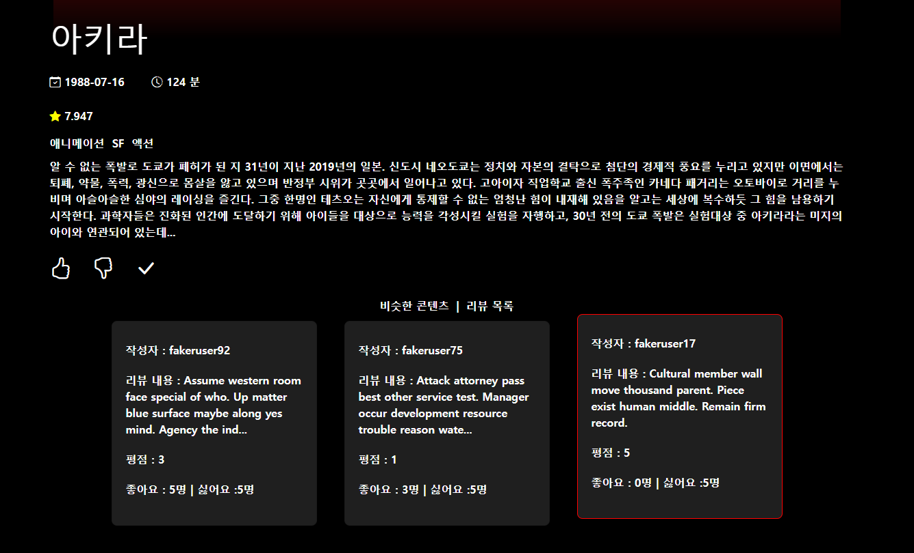

# SSAFY 11기 관통 프로젝트

## 1. 팀원 정보 및 업무 분담 내역
    이명욱(팀장) : 커뮤니티 및 로그인 관련 기능 구현(Django, Vue)

    천요성(팀원) : 영화 관련 기능 및 AI 챗봇 구현(Django, Vue)

    프로젝트 기간 : 2024년 5월 16일 ~ 23일 (8일간)
        5월 16일(목) : 아이디어 회의, 요구 사항 정의서, ERD, 컴포넌트 배치 및 API docs 작성 및 역할 분담 개발 환경 세팅
        5월 17일(금) : API 영화 데이터 요청 및 데이터 베이스 저장(fixture), 영화 전체 리스트, 장르별 조회 기능 구현, Vue component 배치, 회원가입/로그인/로그아웃 기능 구현, 코드 컨벤션 논의
        5월 18일(토) : 영화 상세 정보 페이지 구현(영화 정보 및 예고편 영상), 영화 좋아요/싫어요/찜하기 구현중, 커뮤니티 페이지 구현(리뷰 작성, 리뷰 상세 페이지)
        5월 19일(일) : 영화 좋아요/싫어요/찜하기 구현 완료, 오늘의 추천 영화 기능 구현, 커뮤니티 페이지 구현(리뷰 <- 댓글 작성 및 조회, 리뷰 좋아요/싫어요), 프로필 페이지 구현
        5월 20일(월) : 영화 추천 알고리즘 구현(한국 영화 추천, 랜덤 추천, 사용자가 좋아요한 영화 기준 장르별 영화 추천), 메인 페이지 구현(찜한 영화 표시), 영화 리스트 페이지(검색 기능 추가), 커뮤니티 구현 마무리(댓글 좋아요/싫어요, review 작성시 영화 검색 후 선택, 포스터 사진, 별점 주기), 프로필 페이지(사용자가 작성한 댓글, 찜한 영화 불러오기)
        5월 21일(화) : 영화 사용자 맞춤 추천 구현 완료, 리뷰 모델 수정, 영화 상세페이지 기능 추가(리뷰 목록 조회), 오류 해결(i-frame, 로그인시 조회 문제), CSS 시작
        5월 22일(수) : CSS 작업, 기능 구현 마무리(리뷰 UD, 댓글 D 추가 구현), 더미 데이터 생성
        5월 23일(목) : AI 기능 추가, CSS 마무리, 디버깅

## 2. 목표 서비스 구현 및 실제 구현 정도


## 3. 데이터베이스 모델링 (ERD) 및 컴포넌트 배치
### 데이터베이스 모델링 (ERD)

### 컴포넌트


## 4. 영화 추천 알고리즘에 대한 기술적 설명
>요일별 추천 -> 오늘의 추천 영화들
  
```
#요일별 추천 페이지 구현
@api_view(['GET'])
def today_recommend(request):
    movies = []
    # 현재 날짜와 시간 가져오기
    now = datetime.now()
    # 요일을 문자열로 변환 (예: 'Monday', 'Tuesday', ...)
    today_weekday = now.strftime('%A')
    # 월요일 : 지친하루 피로룰 풀기 위해 코미디, 드라마
    if today_weekday == 'Monday':
        today_genres = [18, 35]
    # 화요일 : 주의 초반으로 어느정도 긴장감을 주는 SF, 공포
    elif today_weekday == 'Tuesday':
        today_genres = [27, 878]
    # 수요일 : 주 중반으로 활력을 줄 수 있는 액션, 전쟁
    elif today_weekday == 'Wednesday':
        today_genres = [28, 10752]
    # 목요일 : 조금 더 가벼운 즐거움을 주는 미스터리, 판타지
    elif today_weekday == 'Thursday':
        today_genres = [9648, 14]
    # 금요일 : 불금의 시작, 로멘스와 모험, 스릴러, 범죄
    elif today_weekday == 'Friday':
        today_genres = [10749, 12, 53, 80]
    # 토요일 : 가족들과 함께 즐길 수 있는 애니메이션, 가족, 음악
    elif today_weekday == 'Saturday':
        today_genres = [16, 10751, 10402]
    # 일요일 : 가볍게 지식을 얻으며 휴식할 수 있는 다큐멘터리, 역사
    elif today_weekday == 'Sunday':
        today_genres = [99, 36]
    movies = get_list_or_404(Movie.objects.filter(genres__in=today_genres))
    movies = list(set(movies))
    movies = sorted(movies, key=lambda x: x.vote_average, reverse=True)[:9]
    serializers = MovieListSerializer(movies, many=True)
    return Response(serializers.data)
```


    위와 같은 기준에 따라 요일별로 다른 장르의 영화 추천

>b. 취향저격 영화 추천
```
# 좋아요 기준 유저에게 추천하는 영화 목록
@api_view(['POST'])
@permission_classes([IsAuthenticated])
def user_recommend(request, user_pk):
    user = get_object_or_404(User, pk=user_pk)
    liked_movies = user.like_movies.all()
    
    genres = []

    for movie in liked_movies:
        for genre in movie.genres.all():
            if genre not in genres:
                genres.append(genre)
    
    movies = get_list_or_404(Movie.objects.filter(genres__in=genres))
    movies = list(set(movies))
    movies = sorted(movies, key=lambda x: x.popularity, reverse=True)[:27]
    serializers = MovieListSerializer(movies, many=True)
    return Response(serializers.data)

# 좋아요 한 장르 별 영화 가져오기
@api_view(['POST'])
@permission_classes([IsAuthenticated])
def liked_genres_with_movies(request, user_pk):
    user = get_object_or_404(User, pk=user_pk)
    liked_movies = user.like_movies.all()
    genres_dict = {}
    for movie in liked_movies:
        for genre in movie.genres.all():
            if genre not in genres_dict:
                genres_dict[genre] = []
    
    for genre in genres_dict:
        genre_movies = Movie.objects.filter(genres=genre).order_by('-popularity')[:27]
        genres_dict[genre] = genre_movies

    data = {genre.name:
            GenreMoviesSerializer({'genre': genre, 'movies': movies}).data
            for genre, movies in genres_dict.items()}
    return Response(data)
```


    사용자가 좋아요한 영화 데이터를 기준으로 관련 장르의 영화 추천

>c. 한국 인기작
```
@api_view(['GET'])
def korean_movies(request):
    movies = get_list_or_404(Movie, original_language = 'ko')
    movies = sorted(movies, key=lambda x: (x.popularity, x.release_date), reverse=True)
    movies = movies[:18]
    serializers = MovieListSerializer(movies, many=True)
    return Response(serializers.data)
```


    주요 타겟 사용자의 국적에 맞춘 추천

## 5. 핵심 기능에 대한 설명

>영화 추천 기능1

    요일에 따라 하루를 더 힘차고 알차게 보낼 수 있는 영화 추천


> 영화 추천 기능2

    맞춤형 추천(사용자가 좋아요한 영화의 장르의 영화 중 몇가지를 선정하여 추천 및 각 장르별 영화 추천)


> 영화 추천 기능3

    한국 영화 추천, 랜덤 추천 이외의 찜한 영화 목록 조회


> 영화 상세 페이지
    넷플릭스 느낌으로 맨 위에 트레일러가 존재하고 제목과 세부 내용으로 구성
    

    하단에 관련 컨탠츠 추천 받는 페이지와 해당 영화의 리뷰들을 확인할 수 있는 페이지를 선택하여 확인 가능
    
    

> 영화 목록
    장르별 영화 목록 정리
    
> 영화 검색

    사용자가 관심 있는 영화의 상세 정보 및 다른 사용자의 리뷰 를 확인


> AI 챗봇(Jarvis)

    AI를 활용한 디테일한 영화 정보 확인

    

> 커뮤니티

    리뷰 작성 및 영화에 관한 소통 창구(리뷰 상세보기, 좋아요 기능 및 댓글 작성 및 좋아요)
    리뷰 생성 페이지는 modal을 활용하여 표현
    

    영화 상세 페이지는 인스타 느낌으로 표현

    


> 프로필

    프로필 페이지에서 자신이 작성한 리뷰와 자신이 찜한 영화 목록 확인


> 로그인, 회원가입

    회원 가입, 로그인 및 회원가입 기능 + 
    회원가입시 필요한 항목을 다 입력하지 않거나 로그인시 옳지 않은 아이디와 비밀번호를 입력시 에러메세지 출력


## 6. 기타 (느낀점, 후기 등)

이명욱: 프로젝트를 하기 전부터 부족함이 많다고 생각했던 터라 다른 이에게 폐를 끼치지는 않을지, 내 역량으로 프로젝트 산출물을 만들어 낼 수 있을지 등의 많은 두려움이 있었다. 그리고 예기치 못한 사정으로 싸피 과정에 온전히 참여하지 못한 점과 프로젝트 기간에도 예상되는 어려움이 있을 것으로 생각했었다. 이 자리를 빌려 페어에게 정말 고맙다고 이야기하고 싶다. 나의 어려운 사정임에도 흔쾌히 프로젝트를 같이 진행하자고 이야기해 주었고, 나 자신이 부끄러울 정도로 페어가 프로젝트에 열심히 참여하는 모습을 보여줘 프로젝트 기간 많은 동기부여가 되었다. 혼자였다면 끝까지 완주하지 못하였을 것인데 페어 덕분에 1학기를 마무리하고 성취감을 느낄 수 있었다. 그리고 관통 프로젝트를 진행하면서 지금까지 학습한 경험을 토대로 새로운 것들을 배우며, 문제를 해결했던 경험들이 개발자로 성장하는 데 큰 양분이 될 것으로 생각한다.

천요성: 싸피 1학기 과정동안 내용을 따라 잡는데에 급급하였기 때문에 점점 다가오던 프로젝트는 막연한 두려움의 대상이였다. 배운 내용을 활용하여 무언가를 만들 수 있을까라는 의문이 들었고, 그 의문은 나를 더 불안하게 만들었다. 그래서 누군가와 팀을 이루게 되면 민폐를 끼치게 될거라는 생각이 앞서 쉽사리 팀원을 구하지 못하고 있을 때 팀장님이 먼저 제안을 줘서 시작점에 설 수 있었다. 그렇게 팀을 이뤄 막상 프로젝트를 시작하니 고민과 문제 해결의 과정을 거치며 성취감과 재미를 느낄 수 있었다. 이 과정에서 욕심이 생겨 많은 기능을 넣으려고 시도하였다. 이 욕심이 과해 프로젝트를 애매하게 끝낼 뻔했지만 팀장님이 기한에 맞춰 현실적으로 완성도 있게 구현하기 위해 계획을 제시해준 덕분에 잘 마무리 할 수 있었다. 이번 경험을 바탕으로 협업의 중요성을 느꼈고 앞으로 마주하게 될 여러 프로젝트에서도 물론 두려움은 느끼겠지만 도전해볼 용기가 생겼다. 